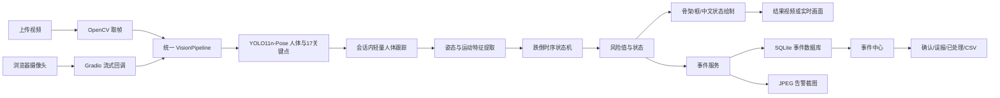
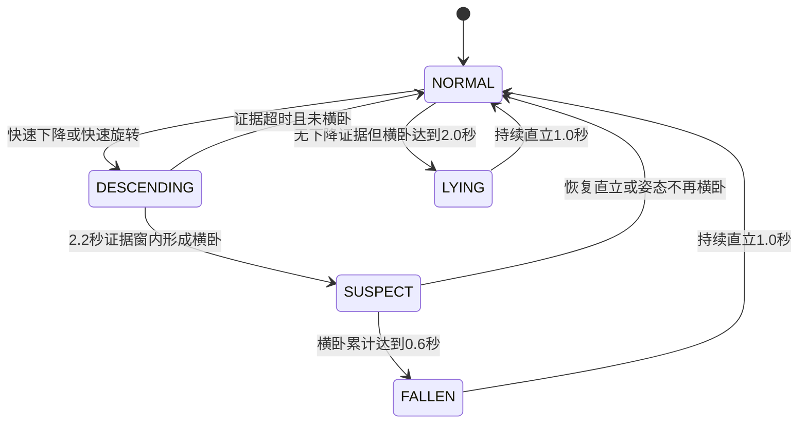

# 暮安智护·视觉跌倒检测系统 MVP 技术详解

> 文档版本：1.0  
> 核对日期：2026-08-12  
> 对应项目目录：`C:\safe`  
> 文档依据：当前项目源码、`config.yaml`、运行环境和自动化测试结果

## 1. 系统定位与当前实现边界

“暮安智护”当前版本是一个**本地运行的视觉跌倒事件检测研究原型**。它已经完成以下闭环：

1. 上传已有视频，逐帧识别人和人体骨架；
2. 使用浏览器摄像头进行实时姿态监测；
3. 在同一人员的短时间历史中计算下降、旋转和横卧特征；
4. 通过时序状态机判断正常、快速下降、疑似跌倒、跌倒和异常躺卧；
5. 生成标注视频、风险曲线、声音/画面告警；
6. 将告警、截图和处理状态写入事件中心；
7. 将历史事件导出为 CSV。

当前真正参与判断的模态只有**RGB 摄像头视觉**。项目名称中的“多模态”代表完整研究方向。

本系统不是医疗器械，不能替代照护人员判断、临床诊断、急救呼叫或真实养老机构的安全系统。

---

## 2. 总体技术架构



系统将上传视频和实时摄像头的差异限制在“怎样得到一帧和时间戳”这一层，两者随后共用 `VisionPipeline.process_frame()`。这样可以保证算法口径一致，也便于将来增加 RTSP 摄像头或新的传感模态。

核心入口和模块如下：

| 层级 | 主要文件 | 职责 |
|---|---|---|
| 用户界面 | `app.py` | 三个页签、回调、状态展示和服务启动 |
| 配置 | `config.yaml`、`core/config.py` | 模型、阈值、视频限制、存储和端口 |
| 感知 | `core/detector.py` | YOLO Pose 模型加载与输出解析 |
| 跟踪 | `core/tracker.py` | 每个会话内的人体 ID 关联 |
| 特征 | `core/features.py` | 躯干角、速度、运动和横卧分数 |
| 决策 | `core/state_machine.py` | 时序证据链、风险值和事件去重 |
| 编排/可视化 | `core/pipeline.py` | 统一帧管线、画框、骨架、中文提示 |
| 离线视频 | `core/video_processor.py` | 解码、时间轴、跳帧、写出和 H.264 转码 |
| 事件与存储 | `services/*.py` | SQLite、截图、CSV 和告警音 |
| 安装与启动 | `setup.bat`、`start.bat`、`scripts/` | 环境安装、模型准备、检查和启动 |

---

## 3. 前端界面与本地 Web 服务

### 3.1 使用技术

- **Gradio Blocks 6.20.0**：用 Python 声明网页组件、事件回调和队列，不需要单独开发前后端工程。
- **Plotly 6.9.0**：绘制上传视频的风险值—时间曲线。
- **HTML/CSS**：顶部渐变标题、指标卡、提示区和页面布局。
- **本地 HTTP 服务**：监听 `127.0.0.1:7860`，`share=False`，默认不公开到互联网。

### 3.2 三个界面页签

#### 视频检测

- `gr.Video` 接收用户上传的视频；
- `gr.Slider` 调整人体框检测置信度，范围 0.15～0.75；
- `gr.Radio` 选择逐帧、每 2 帧或每 3 帧运行一次模型；
- 检测后显示标注视频、最高风险、告警数量、风险曲线和本次事件；
- `gr.File` 提供结果视频下载。

#### 实时监测

- 使用 `gr.Image(sources=["webcam"], type="numpy", streaming=True)` 获取浏览器摄像头画面；
- 每约 0.2 秒提交最新画面，`trigger_mode="always_last"` 在处理跟不上时优先保留最新帧，防止旧帧排队造成高延迟；
- 单次流最长 60 秒，浏览器可继续发起后续流式处理；
- 显示标注图、状态、风险、处理 FPS、最近告警和提示音；
- 支持重置时序状态、确认最近告警或标记误报。

摄像头组件传入的是 RGB 数组，而 OpenCV/YOLO 管线内部统一使用 BGR，因此回调会进行 `RGB → BGR` 转换，输出网页前再转回 RGB。

#### 事件中心

- 读取 SQLite 中的历史告警；
- 汇总总事件、待处理、确认/处理和误报数量；
- 点击一行查看事件详情与告警截图；
- 将事件状态改为已确认、误报或已处理；
- 导出带 UTF-8 BOM 的 CSV，便于 Microsoft Excel 正确显示中文。

### 3.3 并发和会话状态

- `gr.State` 为每个摄像头会话保存独立的 `session_id`、轨迹、历史和最近告警；
- 不用全局 `deque` 保存人员历史，避免不同浏览器或不同任务串数据；
- 上传视频每次都调用 `new_stream_state()` 创建独立状态；
- 模型本身是全局只读资源，但推理由 `threading.RLock` 保护；
- 上传和摄像头使用同一个 `concurrency_id="pose-inference"`，并发上限为 1；
- 全局 Gradio 队列最多等待 8 个任务，以控制 CPU 和内存压力。

---

## 4. 视频上传、解码与结果视频生成

主要实现位于 `core/video_processor.py`。

### 4.1 输入检查

- 文件必须存在并且是普通文件；
- 默认最大 300 MB；
- 默认最大时长 600 秒；
- 使用 `cv2.VideoCapture` 解码；
- FPS 为 0、NaN 或异常时回退到 25 FPS；
- 无法读取分辨率、零帧或明显提前结束时返回中文错误；
- 中文路径先复制成 UUID 临时文件名再解码，规避部分 Windows/OpenCV 路径兼容问题；
- 所有 `VideoCapture`、`VideoWriter` 在 `finally` 中释放，失败时清理未完成结果。

### 4.2 时间轴

上传视频的算法时间戳为：

```text
timestamp_s = frame_index / fps
```

因此事件时间对应原视频位置，而不是电脑实际推理耗时。即使 CPU 处理 10 秒视频用了 40 秒，原视频第 5 秒发生的事件仍记录为 5 秒。

### 4.3 跳帧策略

`frame_stride` 被限制在 1～5：

- stride=1：每帧运行 YOLO，精度和时序连续性最好；
- stride=2/3：减少 CPU 推理次数；
- 未推理帧使用 `render_cached()` 绘制最近一次轨迹和状态；
- 输出视频仍写入全部原始帧，保持原 FPS 和时长。

跌倒动作通常很短，正式测试建议优先用逐帧检测。

### 4.4 输出编码

1. OpenCV 先用 `mp4v` 写入临时 MP4；
2. `imageio-ffmpeg` 提供项目内置 FFmpeg 可执行文件；
3. 转码为 H.264（`libx264`）、`yuv420p`；
4. 使用 `+faststart` 把 MP4 索引移到文件前部，便于浏览器快速播放；
5. 使用 `-an` 去除音轨；
6. 若 H.264 转码失败，则保留 OpenCV 生成的视频并给出兼容性提示。

结果名称使用 UUID，例如 `..._detected.mp4`，不会直接复用上传文件名，降低路径冲突和覆盖风险。

---

## 5. YOLO 人体姿态识别

### 5.1 模型

- 框架：Ultralytics YOLO；
- 权重：`models/yolo11n-pose.pt`；
- 任务：Pose Estimation（人体姿态估计）；
- 当前设备：CPU；
- 默认输入尺寸：512；
- 默认人体框置信度：0.30；
- 默认关键点置信度：0.25。

YOLO 在这里**不直接输出“跌倒”类别**。它只完成单帧基础感知：

1. 找到人体边界框；
2. 给出人体框置信度；
3. 输出 COCO 格式的 17 个二维关键点及其置信度。

之后的跟踪、速度、横卧判断、时序状态机和事件管理都是项目自身逻辑。

### 5.2 使用的关键点

模型会输出 17 个 COCO 人体关键点。当前特征计算重点使用：

| 索引 | 关键点 |
|---:|---|
| 5、6 | 左肩、右肩 |
| 11、12 | 左髋、右髋 |

膝、踝、肘、腕等关键点目前主要用于骨架可视化，尚未进入核心跌倒公式。这使算法较轻，但也限制了对坐、跪、绊倒脚部动作的细粒度理解。

### 5.3 模型管理与线程安全

- 模型使用延迟加载：第一次检测时才加载，缩短仅查看页面时的启动过程；
- `setup.bat` 会提前运行 `scripts/download_model.py` 下载权重；
- 权重不存在时，程序会尝试由 Ultralytics 下载并复制到 `models`；
- 模型加载和 `predict()` 都使用重入锁，防止同一个模型对象被多个任务同时调用；
- 当前采用无状态 `predict()`，未共享 Ultralytics 的 `persist=True` 跟踪器，从而避免两个视频流串联跟踪状态。

### 5.4 输出数据结构

每个人被转换成 `PersonPose`：

```text
track_id
bbox_xyxy              # x1, y1, x2, y2
box_confidence
keypoints_xy           # K×2 数组
keypoint_confidence    # K 个置信度
```

无检测结果、无关键点、关键点数组结构异常时返回空列表；核心肩髋关键点低于阈值时，后续特征标记为无效，不会用 0 假装为真实测量。

---

## 6. 会话内轻量人体跟踪

主要实现位于 `core/tracker.py`。

### 6.1 为什么需要跟踪

跌倒是时间过程，必须知道“第 t 帧的人”和“第 t+1 帧的人”是否为同一个人，才能计算下降速度和姿态变化。因此系统给每个人分配 `track_id`，并按 ID 保存历史。

### 6.2 匹配方法

当前跟踪器使用两种几何指标：

1. **IoU（交并比）**：新旧边界框的重叠面积除以并集面积；
2. **归一化中心距离**：两个框中心点的距离除以人体框尺度。

如果满足以下任一条件，就把检测和旧轨迹作为候选：

```text
IoU >= 0.25
或
中心距离比例 <= 0.45
```

候选按“更大 IoU、再更小中心距离”排序并一对一贪心分配。没有匹配的检测获得新 ID。超过 0.8 秒没有出现的轨迹会过期。

### 6.3 特点与局限

优点：

- 算法轻量，适合 CPU；
- 每个 `stream_state` 独立，不会跨用户串状态；
- 不依赖全局 YOLO 跟踪器。

局限：

- 没有人脸、衣着或 Re-ID 外观特征；
- 多人交叉、严重遮挡或快速移动时可能切换 ID；
- 当前 MVP 更适合单房间、单人为主的画面。

---

## 7. 姿态与运动特征提取

主要实现位于 `core/features.py`，输出 `PoseFeatures`。

### 7.1 有效性检查

计算前要求：

- 图像和人体框尺寸有效；
- 至少具有肩、髋所需关键点；
- 左右肩髋四点至少有三个达到 0.25，且肩部和髋部各至少有一个可靠点；
- 肩中心到髋中心的躯干向量长度至少为 2 像素。

不满足时返回 `valid=False`，状态显示“姿态不完整”，避免低质量骨架制造假跌倒。

### 7.2 肩中心、髋中心和人体中心

```text
肩中心 S = (左肩 + 右肩) / 2
髋中心 H = (左髋 + 右髋) / 2
人体中心 C = (S + H) / 2
```

### 7.3 躯干相对竖直角

令躯干向量 `T = S - H = (dx, dy)`：

```text
torso_angle = atan2(|dx|, |dy|) × 180 / π
```

- 接近 0°：身体接近竖直；
- 接近 90°：躯干接近水平。

由于使用绝对值，该特征不区分向左倒还是向右倒。

### 7.4 尺度无关位置

```text
center_y_norm = C_y / 图像高度
hip_y_norm    = H_y / 图像高度
```

图像坐标向下为正，因此 `center_y_norm` 随时间增大表示人体向画面下方移动。归一化后，不同视频分辨率可以使用相近阈值。

系统没有把“髋部超过画面高度的固定比例”直接当作跌倒，因为地面位置会随机位变化。

### 7.5 人体框宽高比

```text
box_aspect = bbox_width / bbox_height
```

站立人体通常较瘦高，横卧人体通常更宽。但宽高比只作为辅助项，不能独立决定跌倒。

### 7.6 短窗口线性回归速度

系统保留最近 1.6 秒的中心位置和躯干角历史，用最小二乘直线斜率计算：

```text
down_velocity  = slope(time, center_y_norm)
angle_velocity = slope(time, torso_angle)
```

这比只比较相邻两帧更能抵抗关键点抖动。时间戳倒退，或相邻有效样本间隔超过 1.0 秒时，速度历史会清空，避免卡顿后产生虚假的巨大速度。

默认快速动作阈值：

- `down_velocity >= 0.20 / s`：人体中心快速下降；
- `angle_velocity >= 48° / s`：躯干快速旋转。

### 7.7 关键点运动幅度

可见关键点相对上一帧的平均位移除以人体框对角线：

```text
motion_norm = mean(||P_t - P_(t-1)||) / bbox_diagonal
```

`motion_norm < 0.018` 被视为较低运动幅度，仅用于增加风险分；它不是红色跌倒告警的硬条件，因为跌倒后的人可能继续挣扎。

### 7.8 横卧分数

```text
angle_component  = clamp((torso_angle - 40) / 30, 0, 1)
aspect_component = clamp((box_aspect - 0.55) / 0.75, 0, 1)

lying_score = clamp(
    0.78 × angle_component +
    0.22 × aspect_component,
    0, 1
)
```

角度权重较高，宽高比只作辅助。进入横卧与退出横卧使用不同阈值形成滞回，减少临界姿态来回跳变：

- 进入：`lying_score >= 0.70` 或躯干角 ≥ 60°；
- 退出：`lying_score <= 0.40` 且躯干角 ≤ 40°。

---

## 8. 跌倒时序状态机

主要实现位于 `core/state_machine.py`。系统不会把 YOLO 的某一帧或某个宽高比直接当作跌倒，而是寻找“姿态转变证据链”。

### 8.1 状态

| 内部状态 | 页面标签 | 含义 |
|---|---|---|
| `NORMAL` | 正常 | 没有形成跌倒证据 |
| `DESCENDING` | 快速下降 | 观察到中心快速下降或躯干快速旋转 |
| `SUSPECT` | 疑似跌倒 | 下降证据后进入横卧，需要持续确认 |
| `FALLEN` | 已检测到跌倒 | 证据链满足，产生红色事件 |
| `LYING` | 躺卧/姿态异常 | 长时间横卧，但缺少先前快速下降证据 |
| `UNKNOWN` | 姿态不完整 | 核心关键点质量不足 |

### 8.2 核心转换



红色跌倒事件的基本逻辑是：

```text
快速下降或快速旋转
        ↓（证据保留 2.2 秒）
身体接近水平
        ↓（持续约 0.6 秒）
FALLEN + 新建事件
```

如果系统没有看到之前的快速下降，会在横卧 2 秒后显示黄色“躺卧/姿态异常”；持续横卧达到 3 秒且姿态质量足够时记录“疑似跌倒”二级事件，但不会播放红色紧急告警。这兼顾漏检召回和正常睡觉、上床等行为的误报控制。

### 8.3 无效关键点与丢检

- 一帧核心关键点无效时返回 `UNKNOWN`；
- 短暂无效不会把不可见时间错误计入连续横卧确认；
- 无效持续达到 0.8 秒会重置该轨迹的状态机计时；速度回归历史则由独立的 1.0 秒有效样本间隔规则负责清空；
- 保留最近事件时间，防止重新出现后立即重复告警；
- 单纯“人消失”不会被解释成跌倒。

### 8.4 恢复和事件去重

- 持续直立约 1 秒后回到 `NORMAL`；
- 首次进入 `FALLEN` 时生成 UUID `event_key`；
- 同一次横卧保持期间不会每帧重复入库；
- 默认事件冷却时间为 9 秒。

---

## 9. 风险评分

风险值范围为 0～100，用于界面表达和事件排序，不是医学概率。

基础计算由以下部分组成：

```text
基础分                                      8
横卧分数贡献               最多 38
中心下降速度贡献           最多 24
躯干角速度贡献             最多 18
下降/旋转证据仍在有效期    +12
横卧且运动幅度低           +8
```

随后按状态限定区间：

| 状态 | 风险范围 |
|---|---:|
| `NORMAL` | 最高 39 |
| `DESCENDING` | 45～69 |
| `SUSPECT` / `LYING` | 60～79 |
| `FALLEN` | 最低 85 |

因此页面常见颜色含义为：

- 绿色：正常或低风险；
- 黄色/橙色：快速变化、疑似或异常躺卧；
- 红色：状态机确认的跌倒事件。

该风险值是**规则型综合分**，没有经过临床概率校准，不能解释为“有 85% 的概率跌倒”。

---

## 10. 统一帧处理管线与图像标注

主要实现位于 `core/pipeline.py`。

每帧处理顺序为：

1. 深拷贝传入的会话状态；
2. 检查时间戳，丢弃 `timestamp <= last_timestamp` 的乱序帧；
3. 调用 YOLO Pose；
4. 给人体分配跟踪 ID；
5. 按 ID 提取特征；
6. 推进每个人的状态机；
7. 汇总本帧最高风险人员；
8. 产生新事件对象；
9. 绘制人体框、关键点、骨架、ID、风险和中文状态；
10. 返回 `FrameResult` 与更新后的会话状态。

### 10.1 骨架绘制

- OpenCV 绘制人体框、骨架线、关键点和英文 ID/RISK；
- 只绘制置信度达到阈值的关键点和连接；
- 不同状态使用不同 BGR 颜色；
- Pillow 加载微软雅黑或黑体，在画面上绘制中文状态面板；
- 如果没有完整人体，显示“请保持全身进入画面”。

### 10.2 性能诊断

每帧返回：

- 检测人数；
- YOLO 推理毫秒数；
- 总处理毫秒数；
- `1000 / total_ms` 得到的处理 FPS。

摄像头页面显示的是算法处理 FPS，不一定等于摄像头原始采集帧率。

---

## 11. 实时摄像头时间与状态处理

实时回调使用 `time.monotonic()` 作为时间戳。它不受系统时钟被用户修改、网络校时或时区变化影响，适合计算帧间时间和速度。

会话状态包含：

```text
version
session_id
next_track_id
tracks                  # 每个 track_id 的框、历史和状态机
last_timestamp_s
frame_count
last_db_event_id
last_alert_text
```

重置按钮、清空摄像头或重新开始监测时会创建新状态，从而清除旧轨迹和旧速度。实时摄像头当前通过浏览器 `MediaDevices/getUserMedia` 摄像头权限采集，由 Gradio 转成 NumPy 图像；它不是 OpenCV 直接读取 Windows 摄像头设备编号。

---

## 12. 告警、事件中心和本地数据存储

### 12.1 事件生成

当某个状态机首次进入 `FALLEN` 时，管线生成事件对象：

```text
event_key
track_id
source_time_s
risk
confidence              # 四个核心肩髋关键点的平均质量
reasons                 # 快速下降、快速旋转、持续横卧等
```

`EventService` 再补充：

- 本地发生时间；
- 来源（上传视频/实时摄像头）；
- 原视频文件名或摄像头名称；
- 事件类型；
- 告警截图路径。

### 12.2 告警截图

- 使用 OpenCV `imencode(".jpg")` 编码；
- JPEG 质量为 90；
- 文件名使用事件 UUID；
- 保存于 `data/snapshots/`；
- 编码失败时数据库中的截图路径为空，不伪造不存在的路径。

### 12.3 SQLite 数据库

文件：`data/events.db`。

技术特点：

- Python 标准库 `sqlite3`，无需安装独立数据库服务；
- 使用 WAL 日志模式，提高读写并行和崩溃恢复能力；
- 事件时间和状态建立索引；
- `event_key` 唯一约束和 `INSERT OR IGNORE` 防止同一事件重复写入；
- Python `RLock` 保护同一进程内数据库操作；
- 连接超时 20 秒。

主要字段：

| 字段 | 含义 |
|---|---|
| `id` | 自增事件编号 |
| `event_key` | 全局唯一 UUID |
| `occurred_at` | 本地时区事件时间 |
| `source` / `source_name` | 上传视频或摄像头来源 |
| `risk` | 规则风险值 |
| `confidence` | 核心关键点平均置信度 |
| `source_time_s` | 原视频中的事件时间 |
| `snapshot_path` | 告警截图路径 |
| `reasons` | 中文触发原因 |
| `status` | 待处理/已确认/误报/已处理 |
| `created_at` / `updated_at` | 建立与更新时间 |

### 12.4 CSV 导出

- 最多导出最近 5000 条；
- 使用 `utf-8-sig`；
- 输出到 `data/exports/`；
- 文件名带随机 UUID 片段；
- 适合在 Excel 中统计真阳性、误报和处理状态。

### 12.5 声音告警

`services/alarm.py` 用 Python 标准库 `wave` 动态生成 1 秒单声道 WAV：

- 采样率 22050 Hz；
- 16 位 PCM；
- 880 Hz 与 660 Hz 交替；
- 使用淡入淡出包络减少爆音；
- 事件触发时交给 `gr.Audio(autoplay=True)`。

浏览器可能限制自动播放，因此红色视觉告警始终是主要提示方式。

---

## 13. 配置系统

`core/config.py` 使用 Python `dataclass(slots=True)` 定义强结构配置，`PyYAML` 从 `config.yaml` 读取值。未知字段不会直接注入对象，所有相对路径都基于项目根目录解析。

主要默认配置：

| 类别 | 参数 | 默认值 | 含义 |
|---|---|---:|---|
| 模型 | `path` | `models/yolo11n-pose.pt` | 权重位置 |
| 模型 | `device` | `cpu` | 推理设备 |
| 模型 | `image_size` | 512 | YOLO 输入尺寸 |
| 模型 | `confidence` | 0.30 | 人体框阈值 |
| 模型 | `keypoint_confidence` | 0.25 | 关键点阈值 |
| 检测 | `history_seconds` | 1.6 s | 速度回归窗口 |
| 检测 | `missing_tolerance_s` | 0.8 s | 轨迹/无效姿态容忍 |
| 检测 | `lying_enter_angle_deg` | 60° | 横卧进入角 |
| 检测 | `lying_exit_angle_deg` | 40° | 横卧退出角 |
| 检测 | `fast_down_velocity` | 0.20/s | 快速下降阈值 |
| 检测 | `fast_angle_velocity` | 48°/s | 快速旋转阈值 |
| 检测 | `descent_timeout_s` | 2.2 s | 转变证据有效期 |
| 检测 | `lying_hold_s` | 0.6 s | 红色跌倒横卧确认 |
| 检测 | `unexplained_lying_s` | 2.0 s | 黄色异常横卧确认 |
| 检测 | `suspected_fall_hold_s` | 3.0 s | 二级疑似事件确认 |
| 检测 | `recovery_upright_s` | 1.0 s | 恢复正常所需直立时间 |
| 检测 | `event_cooldown_s` | 9.0 s | 告警冷却 |
| 视频 | `max_file_mb` | 300 MB | 上传大小上限 |
| 视频 | `max_duration_s` | 600 s | 上传时长上限 |
| 服务 | `host` | `127.0.0.1` | 仅本机访问 |
| 服务 | `port` | 7860 | 本地端口 |

这些阈值只是 MVP 起点，不是临床标准。调参时应保留独立测试集，不能一边看测试结果一边不断调整同一批样本后再把它当最终准确率。

---

## 14. 安装、启动与运行环境

### 14.1 `setup.bat`

首次安装或修复环境时完成：

1. 检查 PATH 中的 Python；
2. 验证 Python 3.10～3.13；
3. 创建项目独立 `.venv`；
4. 升级 pip；
5. 安装 `requirements.txt`；
6. 下载 YOLO11n-Pose 权重；
7. 导入检查依赖；
8. 运行 pytest 自动化测试。

### 14.2 `start.bat`

- 切换到脚本所在目录；
- 检查 `.venv` 是否存在；
- 检查 7860 端口是否已经监听；
- 如果系统已运行，只打开现有网页，不重复启动第二份服务；
- 否则用虚拟环境 Python 执行 `app.py`；
- 设置 `PYTHONUTF8=1`，改善 Windows 中文输出。

### 14.3 当前已核实环境

| 软件 | 当前版本/状态 |
|---|---|
| Python | 3.13.9 |
| 操作系统 | Windows 11 x64（当前构建号 10.0.26200） |
| 处理器策略 | CPU 推理；当前 PyTorch `CUDA=False` |
| 显卡 | Intel Arc Graphics；当前版本未启用 GPU 加速 |
| Gradio | 6.20.0 |
| Ultralytics | 8.4.118 |
| OpenCV | 4.14.0 |
| NumPy | 2.5.2 |
| Plotly | 6.9.0 |
| PyYAML | 6.0.3 |
| Pillow | 12.3.0 |
| imageio-ffmpeg | 0.6.0 |
| PyTorch | 2.13.0+cpu |
| torchvision | 0.28.0+cpu |
| 模型 | `yolo11n-pose.pt`，约 6.26 MB |

`requirements.txt` 对 Gradio 使用精确版本，对其余主要包使用兼容版本区间。因此换电脑重新安装时，除 Gradio 外的小版本可能与上表不同；正式答辩或可重复实验可另生成完全锁定的环境清单。

PyTorch 和 torchvision 目前由 Ultralytics 依赖链安装，没有在 `requirements.txt` 中直接锁定。当前 `.venv` 还记录了本机 Anaconda Python 的绝对位置，所以它适合在本机使用，但不应直接复制到另一台电脑；换电脑时应复制源码、模型和必要数据，再运行 `setup.bat` 重建环境。

Gradio 的 `allowed_paths` 只开放结果视频、告警截图、CSV 导出和告警音目录给网页读取；模型、数据库和上传临时目录没有直接作为静态文件暴露。若以后把服务地址由 `127.0.0.1` 改为 `0.0.0.0`，必须增加登录认证、访问控制和 HTTPS，不能直接暴露到公网。

---

## 15. 自动化测试和质量保证

测试框架为 pytest。当前共有 14 项测试，覆盖：

| 测试文件 | 内容 |
|---|---|
| `test_features.py` | 站立/横卧分离、窗口下降速度、低质量关键点 |
| `test_state_machine.py` | 完整跌倒证据链、单事件去重、初始横卧、躺卧转身、恢复、长丢检 |
| `test_tracker.py` | 邻近框保持 ID、旧轨迹过期 |
| `test_pipeline_sessions.py` | 两个会话的历史互不共享 |
| `test_database.py` | SQLite 增查改、去重、CSV |
| `test_video_processor.py` | AVI 读取、结果视频写出与可再打开 |
| `test_ui_smoke.py` | Gradio Blocks 构建和摄像头会话状态 |

本次文档生成前已实际运行：

```text
14 passed
```

出现了一条 pytest 缓存目录无写权限警告，不影响测试结论，也不影响主程序运行。

当前单元测试默认不调用真实 YOLO 权重，以保证快速和离线可重复；项目另有测试视频，并已验证其可解码及 YOLO 能检测到人体。正式研究评估还应补充视频级 Precision、Recall、F1、每小时误报、方向召回率和告警延迟。

### 15.1 测试视频技术处理

`test_videos/` 当前包含 24 个 MP4：12 个 URFD 原始“深度图＋RGB”并排视频，以及 12 个为当前视觉版准备的 RGB 文件。直接上传版经过以下处理：

1. 截取原视频右半部分的 RGB 彩色画面；
2. 由 320×240 放大到 640×480；
3. 编码为 H.264、`yuv420p`、30 FPS MP4；
4. 按跌倒正例 `POS` 和日常活动负例 `NEG` 分目录；
5. 用 OpenCV 检查首帧、末帧、帧数和时长；
6. 用项目内 YOLO11n-Pose 抽帧检查，12 段直接上传版均能检测到人体。

`ground_truth.csv` 保存标签、来源 URL、许可、分辨率、帧率和变换信息。它适合功能烟测和初步误报观察，但 6 个正例和 6 个负例远不足以证明模型总体准确率。

---

## 16. 隐私、安全和许可证

### 16.1 隐私与安全

- 推理、数据库和文件默认都在本机；
- 服务器只绑定 `127.0.0.1`；
- 结果视频、截图和数据库都可能包含个人信息；
- 项目转交、展示或上传代码仓库前应清理 `data/`；
- 自采数据必须取得受试者知情同意并设置保存期限；
- 不得让老年人模拟跌倒，健康成年人模拟也必须使用软垫、护具和保护人员；
- 当前系统不会也不应在未经授权时自动联系真实急救服务。

### 16.2 软件和数据许可

- 项目依赖分别具有各自许可证；
- 当前安装的 Ultralytics 8.4.118 包元数据显示为 **AGPL-3.0**；软件/模型许可仍需以使用和发布时的官方条款为准；
- 学生研究与未来商业化是不同使用情境，商业化或闭源交付前必须重新核对 Ultralytics 授权；
- `imageio-ffmpeg` 随环境携带的 FFmpeg 7.1 构建启用了 GPLv3 选项和 `libx264`；若把整个 `.venv` 或该二进制对外分发，需要单独核对并履行相应许可证义务；
- 当前项目根目录尚未包含项目自有 `LICENSE`、`NOTICE` 或完整第三方许可证清单，对外发布前应补齐；
- 随项目整理的 UR Fall Detection Dataset 测试视频采用 CC BY-NC-SA 4.0，仅适合非商业学术用途并需要署名。

---

## 17. 当前局限与建议升级顺序

### 17.1 当前局限

1. 当前仅使用 RGB 视觉，尚未实现多模态融合；
2. 主要使用肩髋四点，坐、跪、脚部绊倒语义有限；
3. 轻量几何跟踪在人群交叉时可能换 ID；
4. 规则阈值对摄像机高度、角度、距离和床面场景敏感；
5. 视频级模型尚未通过大规模受试者独立数据校准；
6. 浏览器告警音可能被自动播放策略拦截；
7. 当前检测的是“已经发生的跌倒事件/异常姿态”，不等同于数天或数月尺度的跌倒风险预测；
8. 没有用户登录、权限、加密、备份、审计日志和远程通知，不适合直接投入养老机构生产环境。
9. 摄像头流式回调与“重置/确认/误报”按钮是不同回调；极端情况下，正在返回的旧帧状态可能覆盖刚执行的按钮状态，生产版应增加同会话锁或统一串行控制。
10. `start.bat` 当前只检查 7860 端口是否有人监听，没有进一步验证占用者一定是本项目；若其他程序占用同一端口，会直接打开该地址。

### 17.2 推荐升级顺序

1. 用正例、强负例、遮挡/低光/多人数据完成基线评估；
2. 记录 Precision、Recall、F1、误报率和告警延迟并调阈值；
3. 增加更稳健的跟踪器和机位标定；
4. 加入动作分类或时序神经网络，与现有规则状态机对比；
5. 实现其他感知模态的独立采集与分类管线；
6. 先做可解释的后融合，再尝试学习型融合；
7. 增加用户权限、事件备注、通知、数据生命周期和审计；
8. 最后再考虑 OpenVINO/ONNX、边缘设备和多房间部署。

---

## 18. 一句话总结每个部分使用的技术

| 部分 | 使用的核心技术 |
|---|---|
| 网页界面 | Gradio Blocks、HTML/CSS、Plotly |
| 视频上传 | Gradio Video、OpenCV VideoCapture |
| 摄像头 | 浏览器 Webcam、Gradio 流式 Image、NumPy RGB/BGR 转换 |
| 人体识别 | Ultralytics YOLO11n-Pose、PyTorch CPU |
| 人体跟踪 | IoU + 归一化中心距离 + 会话内轨迹状态 |
| 姿态特征 | COCO 肩髋关键点、躯干角、宽高比、归一化坐标 |
| 运动特征 | 1.2 秒窗口线性回归速度、尺度归一化关键点位移 |
| 跌倒判断 | 有滞回的规则特征 + 有限状态机 + 时间证据链 |
| 风险值 | 横卧、下降、旋转、证据窗和低运动的规则加权 |
| 图像标注 | OpenCV 几何绘制 + Pillow 中文字体 |
| 结果视频 | OpenCV VideoWriter + imageio-ffmpeg/libx264 H.264 |
| 告警 | Gradio Audio + Python wave 生成 WAV + 红色视觉状态 |
| 事件中心 | SQLite WAL、唯一事件键、状态流转、JPEG 截图、CSV |
| 配置 | dataclass + PyYAML |
| 安装启动 | Python venv、pip、Windows Batch、PowerShell 端口检查 |
| 测试 | pytest、假检测器/假管线、数据库与视频回归测试 |
| 后续多模态 | 新模态采集、信号预处理、质量加权和融合引擎（尚未实现） |

该 MVP 的关键设计思想是：**YOLO 负责看清人体姿态，短时历史负责看懂姿态变化，状态机负责把变化组织成可解释的跌倒证据链，事件中心负责让告警可追踪和可人工复核。**
