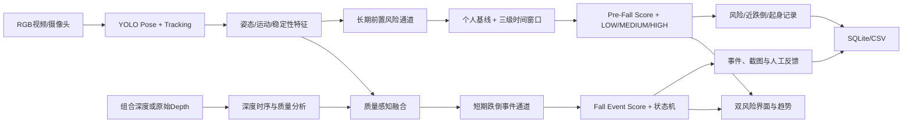
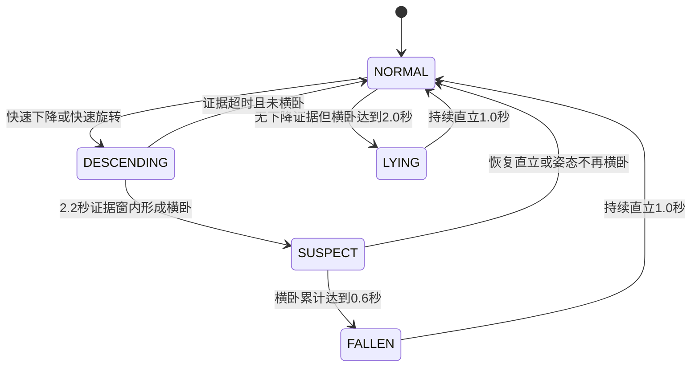

# 暮安智护·跌倒全周期风险监测系统 MVP 技术详解

> 2026-09-24 状态更新：人体三维测量已延期，正式实时会话不再构造、加载或调用三维分析器，页面隐藏安装位置核对和三维指标，记录详情不展示旧三维字段。保留 core/spatial.py、独立标定/验证/评估工具及测试；spatial 配置仅供保留工具使用，不会启用正式监测。历史原始数据不改写，新记录不生成 body_3d。RGB、场景级深度融合、质量降级和个人基线规则继续保留。恢复时须完成本机标定和独立验证，再显式恢复接入。

> 文档版本：2.4  
> 文档整理日期：2026-09-24；早期算法指标仍按其原报告日期  
> 对应项目目录：`C:\safe`  
> 文档依据：当前项目源码、`config.yaml`、自动化测试、真实视频逐事件标注和专项评测结果

2026-09-13 的界面修订在原有历史页按需加载、会话快照分页基础上，接入“暮安智护”品牌入口与侧边栏工作台。2026-09-07界面回归为78项通过，2026-09-13统一助手及界面优化阶段已记录139项离线测试通过；后续局部样式与面板调整使用针对性浏览器检查，本次文档同步未重跑测试；算法专项指标仍引用2026-09-02验收，本轮未重新运行真实人体视频准确率评测，也未修改检测策略。

## 1. 系统定位与当前实现边界

“暮安智护”当前版本是一个**本地运行的跌倒全周期风险监测研究原型**。系统同时运行两个相互独立、共享基础感知能力的通道：

- **长期通道——Pre-Fall Risk**：分析运动速度、身体稳定性、近跌倒、Sit-to-Stand、个人行为基线及其24小时/30天趋势，输出 LOW/MEDIUM/HIGH 工程风险等级和可解释风险因素；
- **短期通道——Fall Event**：分析快速下降、躯干旋转、横卧和深度变化，输出当前跌倒事件证据分、疑似跌倒或确认跌倒状态。

当前系统可以上传普通 RGB 视频或“左深度、右 RGB”组合视频，也可以通过浏览器摄像头进行实时 RGB 监测；能够生成标注视频、双风险曲线、风险历史、告警截图和 CSV 报告。个人基线、近跌倒、起身能力、三级时间窗口和风险等级变化均可写入 SQLite 并在新监测会话中恢复。

项目已经具备 RGB＋Depth 质量感知融合能力。核心管线还支持单独传入原始16位或浮点深度帧，并计算度量距离变化、深度纵向速度和深度空间分；但**Astra Pro原始深度已接入实时页面**，以场景级深度证据参与融合。浏览器摄像头仍为单路RGB；上传仍使用既有视频入口。

当前监测档案仍使用固定的 `person_id`，尚未提供完整的监测对象新增、切换、编辑和删除界面；高风险主动提醒、家属/照护者通知和无人响应升级闭环也尚未实现。上述三项属于已确认延期范围，不作为当前版本完成判定的阻塞项。

本系统不是医疗器械，不能替代照护人员判断、临床诊断、急救呼叫或真实养老机构的安全系统。

---

## 2. 总体技术架构



系统将上传视频和实时摄像头的差异限制在“怎样得到一帧和时间戳”这一层，两者随后共用 `VisionPipeline.process_frame()`。这样可以保证算法口径一致，也便于将来增加 RTSP 摄像头或新的传感模态。

核心入口和模块如下：

| 层级 | 主要文件 | 职责 |
|---|---|---|
| 用户界面 | `app.py` | 四个页签、回调、双风险展示、趋势和服务启动 |
| 配置 | `config.yaml`、`core/config.py` | 模型、阈值、视频限制、存储和端口 |
| 感知 | `core/detector.py` | YOLO Pose 模型加载与输出解析 |
| 跟踪 | `core/tracker.py` | 每个会话内的人体 ID 关联 |
| 特征 | `core/features.py` | 躯干角、速度、运动和横卧分数 |
| 决策 | `core/state_machine.py` | 时序证据链、跌倒事件证据分和事件去重 |
| 前置风险 | `core/pre_fall.py` | 运动/稳定性、近跌倒、Sit-to-Stand、个人基线、三级窗口和风险状态机 |
| 多模态 | `core/depth_pipeline.py`、`core/multimodal.py`、`core/fusion.py` | 原始/组合深度处理、质量判断、前置融合和事件决策融合 |
| 编排/可视化 | `core/pipeline.py` | 统一帧管线、画框、骨架、中文提示 |
| 离线视频 | `core/video_processor.py` | 解码、时间轴、跳帧、写出和 H.264 转码 |
| 事件与存储 | `services/*.py` | SQLite、截图、CSV 和告警音 |
| 历史展示状态 | `services/history.py` | `HistoryPage` 会话快照、页码、每页条数与边界处理 |
| 评测 | `core/evaluation.py`、`scripts/evaluate_*.py` | 消融、逐事件匹配、混淆矩阵和专项报告 |
| 安装与启动 | `setup.bat`、`start.bat`、`scripts/` | 环境安装、模型准备、检查和启动 |

---

## 3. 前端界面与本地 Web 服务

### 3.1 使用技术

- **Gradio Blocks 6.20.0**：用 Python 声明网页组件、事件回调和队列，不需要单独开发前后端工程。
- **Plotly 6.9.0**：分别绘制跌倒事件证据分和前置风险分的时间曲线。
- **HTML/CSS与内嵌SVG**：A「暮光守护」品牌栏、浅色内容区、指标卡、提示区和分页布局；品牌图标不依赖外部图片或脚本。
- **本地 HTTP 服务**：监听 `127.0.0.1:7860`，`share=False`，默认不公开到互联网。

### 3.2 四个界面页签

#### 视频检测

- `gr.Video` 接收用户上传的视频；
- `gr.Slider` 调整人体框检测置信度，范围 0.15～0.75；
- `gr.Radio` 选择逐帧、每 2 帧或每 3 帧运行一次模型；
- 检测后显示标注视频、最高风险、告警数量、风险曲线和本次事件；
- `gr.File` 提供结果视频下载。

#### 实时监测

- 使用 `gr.Image(sources=["webcam"], type="numpy", streaming=True)` 获取浏览器摄像头画面；
- 每约 0.2 秒提交最新画面，`trigger_mode="always_last"` 在处理跟不上时优先保留最新帧，防止旧帧排队造成高延迟；
- 单次流最长 60 秒，浏览器可继续发起后续流式处理；
- 显示标注图、状态、风险、处理 FPS、最近告警和提示音；
- 支持重置时序状态、确认最近告警或标记误报。

摄像头组件传入的是 RGB 数组，而 OpenCV/YOLO 管线内部统一使用 BGR，因此回调会进行 `RGB → BGR` 转换，输出网页前再转回 RGB。

#### 事件中心

- 首次进入读取SQLite中最近200条历史告警，默认每页20条，可选50条或原表格整表模式；
- 汇总总事件、待处理、确认/处理和误报数量；
- 点击一行查看事件详情与告警截图；
- 将事件状态改为已确认、误报或已处理；
- 导出带 UTF-8 BOM 的 CSV，便于 Microsoft Excel 正确显示中文。

返回已打开的页签会保留页码和快照；“刷新记录”主动获取最新数据并回到第一页。翻页、更改页大小后会清空事件选择，避免将旧行位置用于另一页的事件。表格仍有10列，可横向滚动查看。

#### 前置风险记录

- 独立展示 Pre-Fall Risk Score 与 LOW/MEDIUM/HIGH 风险等级，不与 Fall Event Score 混用；
- 展示运动/步态、稳定性、起身能力、短时、24小时和30天风险趋势；
- 展示风险因素、等级变化、近跌倒和 Sit-to-Stand 记录；
- 支持导出前置风险记录，便于复核时间窗口和个人基线变化。

历史表仍有24列，浏览最近500条记录，默认每页20条，可选50条或原表格整表模式。“刷新风险记录”重新取数；趋势图始终使用最近500条窗口内的完整样本，包含前置风险分、短时、24小时、30天和深度空间证据5条曲线，不随当前表格页截断。

### 3.3 并发和会话状态

- `gr.State` 为每个摄像头会话保存独立的 `session_id`、轨迹、历史和最近告警；
- 不用全局 `deque` 保存人员历史，避免不同浏览器或不同任务串数据；
- 上传视频每次都调用 `new_stream_state()` 创建独立状态；
- 模型本身是全局只读资源，但推理由 `threading.RLock` 保护；
- 上传和摄像头使用同一个 `concurrency_id="pose-inference"`，并发上限为 1；
- 全局 Gradio 队列最多等待 8 个任务，以控制 CPU 和内存压力。

历史读取、翻页、页大小切换、事件详情和事件状态回调设置 `queue=False`，无需经过Gradio排队接口；CSV导出保持原有队列配置。Gradio的默认并发限制按函数/并发组应用，并不是所有回调共用一条串行队列；本次优化没有提高模型推理并发。切换页签也不会自动停止摄像头，上传视频分析前仍应先停止实时监测。

### 3.4 历史页按需加载与分页

`services/history.py` 定义 `@dataclass(slots=True)` 的 `HistoryPage`，保存 `rows`、`page`、`loaded`、`page_size`。两个历史页分别用独立 `gr.State` 保存服务端会话快照，快照不作为整表数据发送给浏览器；浏览器表格只接收 `visible_rows`。

| 用户操作 | 处理方式 | 数据与界面更新 |
|---|---|---|
| 初次打开应用 | 两张隐藏历史表初始为空，无重复 `app.load` 历史回调 | 不预先查询或传输历史整表 |
| 首次进入历史页 | `open_event_history` / `open_pre_fall_history` 调用加载函数 | 创建快照并发送第一页；风险页同时绘制完整窗口曲线 |
| 返回已打开页签 | `loaded=True` 时返回 `gr.skip()` | 保留当前页，不重查、不重绘 |
| 上下翻页 | `HistoryPage.moved()` 截取快照 | 不查数据库；风险翻页不输出图表更新 |
| 更改每页条数 | `HistoryPage.resized()` 重置到第一页 | 沿用已有快照；不重画风险曲线 |
| 点击刷新 | 重新读取数据并建立快照 | 回到第一页，更新摘要与风险曲线 |
| 更新事件状态 | 校验事件仍属于当前页，写入后重读记录和统计 | 保留可用页码与页大小，清空旧选择 |

默认 `HISTORY_PAGE_SIZE=20`；合法页大小为20、50和0，其中0对应“全部（原表格模式）”。无效页大小回退20，空表保持安全页数并禁用翻页。快照使新增检测记录不会在翻页期间挤动旧行，用户刷新后才看到新记录。

这里采用**有界历史窗口的服务端会话快照切片**，不是对数据库全部历史进行 `LIMIT/OFFSET` 分页。首次仍查询最多200条事件或500条风险；优化重点是减少向浏览器传输的行数与重复渲染，不是扩大历史范围。分页模式下表格组件的排序、复制和全屏仅操作当前页；“全部”恢复原有窗口全部行，仍不是数据库无限量历史。CSV则独立查询最多5000条，不随当前页变化。

风险记录加载使用一次 `list_pre_fall_records(limit=500)`，同时供 `pre_fall_rows_from_records()` 格式化表格、生成趋势和摘要，避免重复读取同一窗口。事件统计仍由 `statistics()` 查询全库，与最近200条表格窗口不是同一计数范围。

分页栏沿用圆角卡片和蓝色描边按钮。按钮尺寸与动画样式限定在 `.primary`、`.secondary`、`.stop` 操作按钮类别，避免干扰表格内部按钮及Plotly工具栏。

### 3.5 品牌入口与侧边栏工作台

入口页使用“让每一步，都多一份安心。”主文案，配有暖金月牙、暮色蓝字标、米白底色和长者居家品牌插画。插画为生成的品牌素材，以本地 JPEG 随项目保存，并内嵌为 data URI；不依赖外部图片、图标或字体服务。月牙由 CSS 绘制，标为装饰性内容，品牌名称和插画替代文本可被辅助技术读取。

`#muan-interface` 内包含欢迎页与工作台。`assets/navigation.js` 由欢迎页 `gr.HTML.js_on_load` 初始化，切换根元素的显示属性，不重新创建组件、不调用业务回调。原生 `gr.Tabs` 的四个页签仍负责选择事件与按需加载；CSS 仅将页签按钮排列为左侧纵向导航。上传内容、参数、结果、会话状态与历史页快照随组件保留。上下方向键及 Home/End 可切换功能。

桌面侧边栏宽224px，较窄桌面为200px，760px及以下切换为可展开的功能菜单。显示工作台后发出窗口尺寸变化通知，帮助原生图表适配可见区域。导航不会启动或停止摄像头；返回首页前检查摄像头输入中是否有活动媒体轨道，若仍开启则留在工作台并提示先停止摄像头。推理队列、双风险评分、分页与导出接口均保留原实现。详细配色与边界见 [DESIGN.md](DESIGN.md)；旧版回归见 [项目历史验收汇编](项目历史验收汇编_20260924.md)，当前界面检查见 [项目历史验收汇编](项目历史验收汇编_20260924.md)。

### 3.6 统一助手、工具视图与知识库（2026-09-13）

`services/assistant_routing.py` 提供本地明确规则和结构化意图分类，`services/ai_assistant.py` 的 `chat_auto` 统一日常、平台、健康和结果问答。紧急规则先于分类与检索；分类失败提示重试，不能等同于可靠医疗分诊。普通聊天可跳过RAG，相关问题按类别选择资料范围。分类和生成均可能产生外部API请求，本地视频推理不依赖该请求。

前端通过 `data-ai-tools-view` 的 `result`、`record`、`knowledge` 状态分别展示解读结果、总结记录、知识与引用。同一抽屉保留独立的来源控件，结果与记录共用一份待发送摘要；准备函数、发送确认和原有聊天回调不变，两个重复的“展开同一摘要折叠区”回调已移除。聊天组件设置 `show_label=False`，避免悬浮标签遮挡正文；聊天体建立独立绘制层，避免遮挡工具抽屉。

`services/knowledge.py` 负责本地向量与BM25混合检索，`knowledge_import.py` 负责资料导入，`knowledge_ui.py` 负责管理和本地预览。管理页预览传入所选 `doc_id`，不是全库搜索；普通回答仅使用满足启用和核对／来源条件的片段。两份PDF的初始导入记录为待核对，后续实际状态以当前数据库为准。

入口页新增左下米白至右上暖杏金的渐变。知识库查询框与按钮等高对齐。这些显示调整不修改检测阈值、分数、基线、历史分页或导出上限。操作和数据路径见 [AI助手使用说明](AI助手使用说明.md)、[RAG知识库使用说明](RAG知识库使用说明.md)。

---

## 4. 视频上传、解码与结果视频生成

主要实现位于 `core/video_processor.py`。

### 4.1 输入检查

- 文件必须存在并且是普通文件；
- 默认最大 300 MB；
- 默认最大时长 600 秒；
- 使用 `cv2.VideoCapture` 解码；
- FPS 为 0、NaN 或异常时回退到 25 FPS；
- 无法读取分辨率、零帧或明显提前结束时返回中文错误；
- 中文路径先复制成 UUID 临时文件名再解码，规避部分 Windows/OpenCV 路径兼容问题；
- 所有 `VideoCapture`、`VideoWriter` 在 `finally` 中释放，失败时清理未完成结果。

### 4.2 时间轴

上传视频的算法时间戳为：

```text
timestamp_s = frame_index / fps
```

因此事件时间对应原视频位置，而不是电脑实际推理耗时。即使 CPU 处理 10 秒视频用了 40 秒，原视频第 5 秒发生的事件仍记录为 5 秒。

### 4.3 跳帧策略

`frame_stride` 被限制在 1～5：

- stride=1：每帧运行 YOLO，精度和时序连续性最好；
- stride=2/3：减少 CPU 推理次数；
- 未推理帧使用 `render_cached()` 绘制最近一次轨迹和状态；
- 输出视频仍写入全部原始帧，保持原 FPS 和时长。

跌倒动作通常很短，正式测试建议优先用逐帧检测。

### 4.4 输出编码

1. OpenCV 先用 `mp4v` 写入临时 MP4；
2. `imageio-ffmpeg` 提供项目内置 FFmpeg 可执行文件；
3. 转码为 H.264（`libx264`）、`yuv420p`；
4. 使用 `+faststart` 把 MP4 索引移到文件前部，便于浏览器快速播放；
5. 使用 `-an` 去除音轨；
6. 若 H.264 转码失败，则保留 OpenCV 生成的视频并给出兼容性提示。

结果名称使用 UUID，例如 `..._detected.mp4`，不会直接复用上传文件名，降低路径冲突和覆盖风险。

---

## 5. YOLO 人体姿态识别

### 5.1 模型

- 框架：Ultralytics YOLO；
- 权重：`models/yolo11n-pose.pt`；
- 任务：Pose Estimation（人体姿态估计）；
- 当前设备：CPU；
- 默认输入尺寸：512；
- 默认人体框置信度：0.30；
- 默认关键点置信度：0.25。

YOLO 在这里**不直接输出“跌倒”类别**。它只完成单帧基础感知：

1. 找到人体边界框；
2. 给出人体框置信度；
3. 输出 COCO 格式的 17 个二维关键点及其置信度。

之后的跟踪、速度、横卧判断、时序状态机和事件管理都是项目自身逻辑。

### 5.2 使用的关键点

模型会输出 17 个 COCO 人体关键点。当前特征计算重点使用：

| 索引 | 关键点 |
|---:|---|
| 5、6 | 左肩、右肩 |
| 11、12 | 左髋、右髋 |

肩髋关键点仍是跌倒事件公式的核心；膝、踝关键点已经用于 Sit-to-Stand 的膝关节角、身体尺度和坐姿—起身—站稳时序判断。肘、腕等关键点仍主要用于骨架可视化，因此系统对扶墙、扶手支撑、捡物和复杂脚部绊倒动作的语义理解仍有限。

### 5.3 模型管理与线程安全

- 模型使用延迟加载：第一次检测时才加载，缩短仅查看页面时的启动过程；
- `setup.bat` 会提前运行 `scripts/download_model.py` 下载权重；
- 权重不存在时，程序会尝试由 Ultralytics 下载并复制到 `models`；
- 模型加载和 `predict()` 都使用重入锁，防止同一个模型对象被多个任务同时调用；
- 当前采用无状态 `predict()`，未共享 Ultralytics 的 `persist=True` 跟踪器，从而避免两个视频流串联跟踪状态。

### 5.4 输出数据结构

每个人被转换成 `PersonPose`：

```text
track_id
bbox_xyxy              # x1, y1, x2, y2
box_confidence
keypoints_xy           # K×2 数组
keypoint_confidence    # K 个置信度
```

无检测结果、无关键点、关键点数组结构异常时返回空列表；核心肩髋关键点低于阈值时，后续特征标记为无效，不会用 0 假装为真实测量。

---

## 6. 会话内轻量人体跟踪

主要实现位于 `core/tracker.py`。

### 6.1 为什么需要跟踪

跌倒是时间过程，必须知道“第 t 帧的人”和“第 t+1 帧的人”是否为同一个人，才能计算下降速度和姿态变化。因此系统给每个人分配 `track_id`，并按 ID 保存历史。

### 6.2 匹配方法

当前跟踪器使用两种几何指标：

1. **IoU（交并比）**：新旧边界框的重叠面积除以并集面积；
2. **归一化中心距离**：两个框中心点的距离除以人体框尺度。

如果满足以下任一条件，就把检测和旧轨迹作为候选：

```text
IoU >= 0.25
或
中心距离比例 <= 0.45
```

候选按“更大 IoU、再更小中心距离”排序并一对一贪心分配。没有匹配的检测获得新 ID。超过 0.8 秒没有出现的轨迹会过期。

### 6.3 特点与局限

优点：

- 算法轻量，适合 CPU；
- 每个 `stream_state` 独立，不会跨用户串状态；
- 不依赖全局 YOLO 跟踪器。

局限：

- 没有人脸、衣着或 Re-ID 外观特征；
- 多人交叉、严重遮挡或快速移动时可能切换 ID；
- 当前 MVP 更适合单房间、单人为主的画面。

---

## 7. 姿态与运动特征提取

主要实现位于 `core/features.py`，输出 `PoseFeatures`。

### 7.1 有效性检查

计算前要求：

- 图像和人体框尺寸有效；
- 至少具有肩、髋所需关键点；
- 左右肩髋四点至少有三个达到 0.25，且肩部和髋部各至少有一个可靠点；
- 肩中心到髋中心的躯干向量长度至少为 2 像素。

不满足时返回 `valid=False`，状态显示“姿态不完整”，避免低质量骨架制造假跌倒。

### 7.2 肩中心、髋中心和人体中心

```text
肩中心 S = (左肩 + 右肩) / 2
髋中心 H = (左髋 + 右髋) / 2
人体中心 C = (S + H) / 2
```

### 7.3 躯干相对竖直角

令躯干向量 `T = S - H = (dx, dy)`：

```text
torso_angle = atan2(|dx|, |dy|) × 180 / π
```

- 接近 0°：身体接近竖直；
- 接近 90°：躯干接近水平。

由于使用绝对值，该特征不区分向左倒还是向右倒。

### 7.4 尺度无关位置

```text
center_y_norm = C_y / 图像高度
hip_y_norm    = H_y / 图像高度
```

图像坐标向下为正，因此 `center_y_norm` 随时间增大表示人体向画面下方移动。归一化后，不同视频分辨率可以使用相近阈值。

系统没有把“髋部超过画面高度的固定比例”直接当作跌倒，因为地面位置会随机位变化。

### 7.5 人体框宽高比

```text
box_aspect = bbox_width / bbox_height
```

站立人体通常较瘦高，横卧人体通常更宽。但宽高比只作为辅助项，不能独立决定跌倒。

### 7.6 短窗口线性回归速度

系统保留最近 1.6 秒的中心位置和躯干角历史，用最小二乘直线斜率计算：

```text
down_velocity  = slope(time, center_y_norm)
angle_velocity = slope(time, torso_angle)
```

这比只比较相邻两帧更能抵抗关键点抖动。时间戳倒退，或相邻有效样本间隔超过 1.0 秒时，速度历史会清空，避免卡顿后产生虚假的巨大速度。

默认快速动作阈值：

- `down_velocity >= 0.20 / s`：人体中心快速下降；
- `angle_velocity >= 48° / s`：躯干快速旋转。

### 7.7 关键点运动幅度

可见关键点相对上一帧的平均位移除以人体框对角线：

```text
motion_norm = mean(||P_t - P_(t-1)||) / bbox_diagonal
```

`motion_norm < 0.018` 被视为较低运动幅度，仅用于增加风险分；它不是红色跌倒告警的硬条件，因为跌倒后的人可能继续挣扎。

### 7.8 横卧分数

```text
angle_component  = clamp((torso_angle - 40) / 30, 0, 1)
aspect_component = clamp((box_aspect - 0.55) / 0.75, 0, 1)

lying_score = clamp(
    0.78 × angle_component +
    0.22 × aspect_component,
    0, 1
)
```

角度权重较高，宽高比只作辅助。进入横卧与退出横卧使用不同阈值形成滞回，减少临界姿态来回跳变：

- 进入：`lying_score >= 0.70` 或躯干角 ≥ 60°；
- 退出：`lying_score <= 0.40` 且躯干角 ≤ 40°。

---

## 8. 跌倒时序状态机

主要实现位于 `core/state_machine.py`。系统不会把 YOLO 的某一帧或某个宽高比直接当作跌倒，而是寻找“姿态转变证据链”。

### 8.1 状态

| 内部状态 | 页面标签 | 含义 |
|---|---|---|
| `NORMAL` | 正常 | 没有形成跌倒证据 |
| `DESCENDING` | 快速下降 | 观察到中心快速下降或躯干快速旋转 |
| `SUSPECT` | 疑似跌倒 | 下降证据后进入横卧，需要持续确认 |
| `FALLEN` | 已检测到跌倒 | 证据链满足，产生红色事件 |
| `LYING` | 躺卧/姿态异常 | 长时间横卧，但缺少先前快速下降证据 |
| `UNKNOWN` | 姿态不完整 | 核心关键点质量不足 |

### 8.2 核心转换



红色跌倒事件的基本逻辑是：

```text
快速下降或快速旋转
        ↓（证据保留 2.2 秒）
身体接近水平
        ↓（持续约 0.6 秒）
FALLEN + 新建事件
```

如果系统没有看到之前的快速下降，会在横卧 2 秒后显示黄色“躺卧/姿态异常”；持续横卧达到 3 秒且姿态质量足够时记录“疑似跌倒”二级事件，但不会播放红色紧急告警。这兼顾漏检召回和正常睡觉、上床等行为的误报控制。

### 8.3 无效关键点与丢检

- 一帧核心关键点无效时返回 `UNKNOWN`；
- 短暂无效不会把不可见时间错误计入连续横卧确认；
- 无效持续达到 0.8 秒会重置该轨迹的状态机计时；速度回归历史则由独立的 1.0 秒有效样本间隔规则负责清空；
- 保留最近事件时间，防止重新出现后立即重复告警；
- 单纯“人消失”不会被解释成跌倒。

### 8.4 恢复和事件去重

- 持续直立约 1 秒后回到 `NORMAL`；
- 首次进入 `FALLEN` 时生成 UUID `event_key`；
- 同一次横卧保持期间不会每帧重复入库；
- 默认事件冷却时间为 9 秒。

---

## 9. 跌倒事件证据分（Fall Event Score）

跌倒事件证据分范围为 0～100，用于表达当前短时间动作与跌倒事件特征的匹配程度，不是医学概率，也不是未来跌倒风险。

基础计算由以下部分组成：

```text
基础分                                      8
横卧分数贡献               最多 38
中心下降速度贡献           最多 24
躯干角速度贡献             最多 18
下降/旋转证据仍在有效期    +12
横卧且运动幅度低           +8
```

随后按状态限定区间：

| 状态 | 风险范围 |
|---|---:|
| `NORMAL` | 最高 39 |
| `DESCENDING` | 45～69 |
| `SUSPECT` / `LYING` | 60～79 |
| `FALLEN` | 最低 85 |

因此页面常见颜色含义为：

- 绿色：正常或低风险；
- 黄色/橙色：快速变化、疑似或异常躺卧；
- 红色：状态机确认的跌倒事件。

该事件证据分是**规则型综合分**，没有经过临床概率校准，不能解释为“有 85% 的概率跌倒”。

---

## 10. 统一帧处理管线与图像标注

主要实现位于 `core/pipeline.py`。

每帧处理顺序为：

1. 深拷贝传入的会话状态；
2. 检查时间戳，丢弃 `timestamp <= last_timestamp` 的乱序帧；
3. 调用 YOLO Pose；
4. 给人体分配跟踪 ID；
5. 按 ID 提取特征；
6. 推进每个人的状态机；
7. 汇总本帧最高风险人员；
8. 产生新事件对象；
9. 绘制人体框、关键点、骨架、ID、风险和中文状态；
10. 返回 `FrameResult` 与更新后的会话状态。

### 10.1 骨架绘制

- OpenCV 绘制人体框、骨架线、关键点和英文 ID/EVENT；
- 只绘制置信度达到阈值的关键点和连接；
- 不同状态使用不同 BGR 颜色；
- Pillow 加载微软雅黑或黑体，在画面上绘制中文状态面板；
- 如果没有完整人体，显示“请保持全身进入画面”。

### 10.2 性能诊断

每帧返回：

- 检测人数；
- YOLO 推理毫秒数；
- 总处理毫秒数；
- `1000 / total_ms` 得到的处理 FPS。

摄像头页面显示的是算法处理 FPS，不一定等于摄像头原始采集帧率。

---

## 11. 实时摄像头时间与状态处理

实时回调使用 `time.monotonic()` 作为时间戳。它不受系统时钟被用户修改、网络校时或时区变化影响，适合计算帧间时间和速度。

会话状态包含：

```text
version
session_id
next_track_id
tracks                  # 每个 track_id 的框、历史和状态机
last_timestamp_s
frame_count
last_db_event_id
last_alert_text
```

重置按钮、清空摄像头或重新开始监测时会创建新状态，从而清除旧轨迹和旧速度。实时摄像头当前通过浏览器 `MediaDevices/getUserMedia` 摄像头权限采集，由 Gradio 转成 NumPy 图像；它不是 OpenCV 直接读取 Windows 摄像头设备编号。

---

## 12. 告警、事件中心和本地数据存储

### 12.1 事件生成

当某个状态机首次进入 `FALLEN` 时，管线生成事件对象：

```text
event_key
track_id
source_time_s
risk
confidence              # 四个核心肩髋关键点的平均质量
reasons                 # 快速下降、快速旋转、持续横卧等
```

`EventService` 再补充：

- 本地发生时间；
- 来源（上传视频/实时摄像头）；
- 原视频文件名或摄像头名称；
- 事件类型；
- 告警截图路径。

### 12.2 告警截图

- 使用 OpenCV `imencode(".jpg")` 编码；
- JPEG 质量为 90；
- 文件名使用事件 UUID；
- 保存于 `data/snapshots/`；
- 编码失败时数据库中的截图路径为空，不伪造不存在的路径。

### 12.3 SQLite 数据库

文件：`data/events.db`。

技术特点：

- Python 标准库 `sqlite3`，无需安装独立数据库服务；
- 使用 WAL 日志模式，提高读写并行和崩溃恢复能力；
- 事件时间、状态及风险记录时间建立索引；新增 `(occurred_at DESC, id DESC)` 和 `(recorded_at DESC, id DESC)` 组合索引，与历史列表的时间/ID降序一致，避免第二排序键需要临时排序；
- `event_key` 唯一约束和 `INSERT OR IGNORE` 防止同一事件重复写入；
- Python `RLock` 保护同一进程内数据库操作；
- 连接超时 20 秒。

组合索引用 `CREATE INDEX IF NOT EXISTS` 幂等建立，不改变既有记录、字段和排序语义；分页没有新增数据删除或清理行为。

主要字段：

| 字段 | 含义 |
|---|---|
| `id` | 自增事件编号 |
| `event_key` | 全局唯一 UUID |
| `occurred_at` | 本地时区事件时间 |
| `source` / `source_name` | 上传视频或摄像头来源 |
| `risk` / `fall_event_score` | 兼容字段 / 明确命名的跌倒事件证据分 |
| `confidence` | 核心关键点平均置信度 |
| `source_time_s` | 原视频中的事件时间 |
| `snapshot_path` | 告警截图路径 |
| `reasons` | 中文触发原因 |
| `status` | 待处理/已确认/误报/已处理 |
| `created_at` / `updated_at` | 建立与更新时间 |

### 12.4 CSV 导出

- 事件与前置风险CSV各自最多导出最近5000条；独立读取数据库，不以当前页、页大小或快照行数作为导出范围；
- 使用 `utf-8-sig`；
- 输出到 `data/exports/`；
- 文件名带随机 UUID 片段；
- 适合在 Excel 中统计真阳性、误报和处理状态。

### 12.5 声音告警

`services/alarm.py` 用 Python 标准库 `wave` 动态生成 1 秒单声道 WAV：

- 采样率 22050 Hz；
- 16 位 PCM；
- 880 Hz 与 660 Hz 交替；
- 使用淡入淡出包络减少爆音；
- 事件触发时交给 `gr.Audio(autoplay=True)`。

浏览器可能限制自动播放，因此红色视觉告警始终是主要提示方式。

---

## 13. 配置系统

`core/config.py` 使用 Python `dataclass(slots=True)` 定义强结构配置，`PyYAML` 从 `config.yaml` 读取值。未知字段不会直接注入对象，所有相对路径都基于项目根目录解析。

主要默认配置：

| 类别 | 参数 | 默认值 | 含义 |
|---|---|---:|---|
| 模型 | `path` | `models/yolo11n-pose.pt` | 权重位置 |
| 模型 | `device` | `cpu` | 推理设备 |
| 模型 | `image_size` | 512 | YOLO 输入尺寸 |
| 模型 | `confidence` | 0.30 | 人体框阈值 |
| 模型 | `keypoint_confidence` | 0.25 | 关键点阈值 |
| 检测 | `history_seconds` | 1.6 s | 速度回归窗口 |
| 检测 | `missing_tolerance_s` | 0.8 s | 轨迹/无效姿态容忍 |
| 检测 | `lying_enter_angle_deg` | 60° | 横卧进入角 |
| 检测 | `lying_exit_angle_deg` | 40° | 横卧退出角 |
| 检测 | `fast_down_velocity` | 0.20/s | 快速下降阈值 |
| 检测 | `fast_angle_velocity` | 48°/s | 快速旋转阈值 |
| 检测 | `descent_timeout_s` | 2.2 s | 转变证据有效期 |
| 检测 | `lying_hold_s` | 0.6 s | 红色跌倒横卧确认 |
| 检测 | `unexplained_lying_s` | 2.0 s | 黄色异常横卧确认 |
| 检测 | `suspected_fall_hold_s` | 3.0 s | 二级疑似事件确认 |
| 检测 | `recovery_upright_s` | 1.0 s | 恢复正常所需直立时间 |
| 检测 | `event_cooldown_s` | 9.0 s | 告警冷却 |
| 视频 | `max_file_mb` | 300 MB | 上传大小上限 |
| 视频 | `max_duration_s` | 600 s | 上传时长上限 |
| 服务 | `host` | `127.0.0.1` | 仅本机访问 |
| 服务 | `port` | 7860 | 本地端口 |

这些阈值只是 MVP 起点，不是临床标准。调参时应保留独立测试集，不能一边看测试结果一边不断调整同一批样本后再把它当最终准确率。

---

## 14. 安装、启动与运行环境

### 14.1 `setup.bat`

首次安装或修复环境时完成：

1. 检查 PATH 中的 Python；
2. 验证 Python 3.10～3.13；
3. 创建项目独立 `.venv`；
4. 升级 pip；
5. 安装 `requirements.txt`；
6. 下载 YOLO11n-Pose 权重；
7. 导入检查依赖；
8. 运行 pytest 自动化测试。

### 14.2 `start.bat`

- 切换到脚本所在目录；
- 检查 `.venv` 是否存在；
- 检查 7860 端口是否已经监听；
- 如果系统已运行，只打开现有网页，不重复启动第二份服务；
- 否则用虚拟环境 Python 执行 `app.py`；
- 设置 `PYTHONUTF8=1`，改善 Windows 中文输出。

### 14.3 已核实环境（2026-09-02）

以下为既有环境检查记录；2026-09-03界面更新未安装或升级依赖。

| 软件 | 当前版本/状态 |
|---|---|
| Python | 3.13.9 |
| 操作系统 | Windows 11 x64（当前构建号 10.0.26200） |
| 处理器策略 | CPU 推理；当前 PyTorch `CUDA=False` |
| 显卡 | Intel Arc Graphics；当前版本未启用 GPU 加速 |
| Gradio | 6.20.0 |
| Ultralytics | 8.4.118 |
| OpenCV | 4.14.0 |
| NumPy | 2.5.2 |
| Plotly | 6.9.0 |
| PyYAML | 6.0.3 |
| Pillow | 12.3.0 |
| imageio-ffmpeg | 0.6.0 |
| PyTorch | 2.13.0+cpu |
| torchvision | 0.28.0+cpu |
| 模型 | `yolo11n-pose.pt`，约 6.26 MB |

`requirements.txt` 对 Gradio 使用精确版本，对其余主要包使用兼容版本区间。因此换电脑重新安装时，除 Gradio 外的小版本可能与上表不同；正式答辩或可重复实验可另生成完全锁定的环境清单。

PyTorch 和 torchvision 目前由 Ultralytics 依赖链安装，没有在 `requirements.txt` 中直接锁定。当前 `.venv` 还记录了本机 Anaconda Python 的绝对位置，所以它适合在本机使用，但不应直接复制到另一台电脑；换电脑时应复制源码、模型和必要数据，再运行 `setup.bat` 重建环境。

Gradio 的 `allowed_paths` 只开放结果视频、告警截图、CSV 导出和告警音目录给网页读取；模型、数据库和上传临时目录没有直接作为静态文件暴露。若以后把服务地址由 `127.0.0.1` 改为 `0.0.0.0`，必须增加登录认证、访问控制和 HTTPS，不能直接暴露到公网。

---

## 15. 自动化测试和质量保证

测试框架为pytest。2026-09-02原有56项全部通过；2026-09-03历史页优化后75项通过，A方案品牌更新后最新结果为 **77/77通过**。最新一轮使用当前虚拟环境在隔离项目副本执行，部署文件与通过测试的候选源码一致。覆盖范围包括：

| 测试文件 | 内容 |
|---|---|
| `test_features.py` | 站立/横卧分离、窗口下降速度、低质量关键点 |
| `test_state_machine.py` | 完整跌倒证据链、单事件去重、初始横卧、躺卧转身、恢复、长丢检 |
| `test_tracker.py` | 邻近框保持 ID、旧轨迹过期 |
| `test_pre_fall.py` | 近跌倒、稳定性、Sit-to-Stand、风险评分、状态平滑和三级窗口 |
| `test_pipeline_sessions.py` | 会话隔离、个人基线跨会话恢复 |
| `test_database.py` | 事件、模态结果、风险记录、个人基线、近跌倒、起身和迁移兼容 |
| `test_multimodal.py` | 帧拆分、原始深度、融合冲突、深度退化和RGB回退 |
| `test_evaluation.py` | 事件匹配、Precision/Recall/F1、延迟和混淆矩阵 |
| `test_video_processor.py` | 视频读取、结果写出、可再打开和多模态管线选择 |
| `test_ui_smoke.py` | Gradio Blocks 构建和摄像头会话状态 |
| `test_history_ui.py` | 分页边界、会话快照、跨页选择与状态、旧选择保护、曲线/导出完整性、整表模式、索引、首次加载与队列绑定（19项） |
| `test_brand_header.py` | 品牌文案、装饰图标可访问性、无外部加载和显式文字对比度（2项） |

历史品牌版本回归记录（2026-09-03）：

```text
77 passed in 23.74s
排除品牌区HTML/CSS后，新旧app.py语法结构一致
正式本地页面已显示A方案品牌文字、颜色与图标
```

在受限沙箱中直接运行测试会因为无法在 `C:\safe` 建立临时目录和打开 SQLite 而出现权限错误；给予项目目录正常写权限后全部测试通过。这属于执行环境权限问题，不是业务逻辑失败。单元测试默认使用假检测器保持快速、离线和可重复；真实 YOLO、RGB＋Depth、26段专项视频和本地 Web 服务另有独立烟测与评测。

本轮隔离测试没有将合成数据写入正式数据库；没有重跑真实RGB＋Depth烟测或26段专项评测，相关数字仍引用2026-09-02报告。仅修改文档也不构成新的算法验收。

### 15.1 测试视频技术处理

`test_videos/` 当前包含38段可解码视频，其中24段为URFD RGB/组合深度视频，14段为外部近跌倒与起身专项视频：

| 视频类型 | 目录 | 文件名 | 数量 | 使用方式 |
|---|---|---|---:|---|
| 普通 RGB 跌倒正例 | `00_ready_to_upload/01_fall_positive/` | `URFD_FALL_01_RGB_POS.mp4`～`URFD_FALL_06_RGB_POS.mp4` | 6 | 在界面选择“普通 RGB 视频”后直接上传 |
| 普通 RGB 日常活动负例 | `00_ready_to_upload/02_daily_activity_negative/` | `URFD_ADL_01_RGB_NEG.mp4`～`URFD_ADL_06_RGB_NEG.mp4` | 6 | 在界面选择“普通 RGB 视频”后直接上传 |
| RGB＋深度跌倒正例 | `01_fall_positive/` | `URFD_FALL_01_CAM0_POS.mp4`～`URFD_FALL_06_CAM0_POS.mp4` | 6 | 选择“RGB＋深度组合视频（左深度、右 RGB）” |
| RGB＋深度日常活动负例 | `02_daily_activity_negative/` | `URFD_ADL_01_CAM0_NEG.mp4`～`URFD_ADL_06_CAM0_NEG.mp4` | 6 | 选择“RGB＋深度组合视频（左深度、右 RGB）” |
| 真实坐下/起身 | `external/caucafall/` | `SitDownS1.avi`～`SitDownS10.avi` | 10 | 逐事件 Sit-to-Stand 验收 |
| 行走/绊踉/跳跃 | `external/sisfall/` | D01、D02、D18、D19 | 4 | 近跌倒正例和困难负例验收 |

快速判断规则：文件名包含 `_RGB_` 的是已经裁剪好的普通 RGB 视频；包含 `_CAM0_` 的是原始左右拼接视频，**左半部分为深度图，右半部分为 RGB 彩色视频**。`POS` 表示跌倒正例，`NEG` 表示日常活动负例。不要把 `00_ready_to_upload/` 下的两个分类子目录与同名的原始组合视频目录混淆。

12 个直接上传版 RGB 视频经过以下处理：

1. 截取原视频右半部分的 RGB 彩色画面；
2. 由 320×240 放大到 640×480；
3. 编码为 H.264、`yuv420p`、30 FPS MP4；
4. 按跌倒正例 `POS` 和日常活动负例 `NEG` 分目录；
5. 用 OpenCV 检查首帧、末帧、帧数和时长；
6. 用项目内 YOLO11n-Pose 抽帧检查，12 段直接上传版均能检测到人体。

`ground_truth.csv` 保存标签、来源 URL、许可、分辨率、帧率和变换信息。它适合功能烟测和初步误报观察，但 6 个正例和 6 个负例远不足以证明模型总体准确率。

---

### 15.2 历史页与品牌界面验证（2026-09-03）

- 真实数据只读副本含16条事件、31条风险记录；历史优化前后表格、摘要和Plotly JSON一致，两类CSV字节级一致。
- 合成500条风险记录遍历25页，唯一ID完整、无重复遗漏，第25页导出仍包含500条；切换整表模式和50条/页正常。事件详情、截图与状态操作另在隔离库检查。
- 满窗口本机观察：200条事件首次进入约1.52秒、500条风险首次进入约1.05秒；重复切换分别约0.65～0.71秒、0.73～1.10秒。耗时包含浏览器自动化与状态检查开销，不是跨机器/负载的时延保证，也不能据此承诺不再出现任何访问故障。
- 桌面和390px窄屏目检确认品牌文字清晰完整；浏览器实际字色为 `rgb(247, 250, 252)`，背景为 `rgb(16, 32, 51)`；品牌文字对比度测试不低于4.5:1，未记录页面错误。
- 分页优化未修改算法核心、风险阈值、模型、依赖和告警服务；随后品牌优化仅改顶部HTML/CSS，未改业务函数、事件绑定和下方布局。

“全部”模式仍需传输原窗口全部行，数据量增大或CPU繁忙时可能比20条/页慢。分页不解决服务退出、端口占用、权限错误或持续资源耗尽；若仍出现无法访问，应单独检查服务与运行日志，不能仅凭页面截图归因于分页。

---

## 16. RGB与深度图多模态融合

### 16.1 输入与统一接口

上传视频可以选择普通RGB或“左侧深度图、右侧RGB”的同步组合模式。`core/multimodal.py` 按配置拆分同一帧，两侧共享帧号和时间戳。核心接口同时支持 RGB 帧与单独的原始深度数组，接受16位整数或浮点距离值。视觉分支、深度分支均输出带时间戳、风险、质量、状态、原因和诊断信息的统一结果。

2026-09-22已将Astra Pro的OpenNI毫米深度和UVC彩色经软件配对接入实时检测管线。深度失效时使用RGB判断，RGB也不可用时中断监测并清空分数。上传组件仍支持普通RGB或左右组合视频。

### 16.2 深度时序证据

`core/depth_pipeline.py` 对两类输入分别处理：

- 对左右组合视频中的深度可视化画面，计算有效像素比例、对比度、帧差运动、运动重心和向下位移，不把灰度值冒充物理距离；
- 对原始16位/浮点深度，直接计算人体区域中位距离变化、深度纵向速度和深度空间分，并保存度量深度诊断字段。

深度分支保留短时证据窗口，区分正常、运动、下降证据、强变化和低位低活动。UTD Kinect v2验收共处理5名受试者、25段深度序列，25/25通过原始度量深度链路要求。

### 16.3 质量感知融合

`core/fusion.py` 先按视觉关键点质量和深度质量计算动态权重，再应用可解释规则：视觉跌倒得到深度支持时确认；两路明显冲突时降级为疑似；视觉不可用但深度出现高质量强变化时只产生保守疑似；深度质量不足时自动退化为原视觉结果。跌倒事件融合之后，深度空间分还会在RGB前置风险评估前参与运动与稳定性风险计算。融合分仍是工程规则分，不是统计概率。

### 16.4 事件记录与降级

多模态事件继续写入原 `events` 表，同时在 `event_modalities` 子表保存每个模态的风险、质量、状态、原因和诊断数据。风险记录还保存深度空间分、深度是否参与以及 `depth_degraded` 状态。结果视频左侧显示深度证据，右侧显示姿态和融合状态；深度不可用或质量不足时，系统继续以RGB模式运行而不是中断。

---

## 17. 隐私、安全和许可证

### 17.1 隐私与安全

- 推理、数据库和文件默认都在本机；
- 服务器只绑定 `127.0.0.1`；
- 结果视频、截图和数据库都可能包含个人信息；
- 项目转交、展示或上传代码仓库前应清理 `data/`；
- 自采数据必须取得受试者知情同意并设置保存期限；
- 不得让老年人模拟跌倒，健康成年人模拟也必须使用软垫、护具和保护人员；
- 当前系统不会也不应在未经授权时自动联系真实急救服务。

### 17.2 软件和数据许可

- 项目依赖分别具有各自许可证；
- 当前安装的 Ultralytics 8.4.118 包元数据显示为 **AGPL-3.0**；软件/模型许可仍需以使用和发布时的官方条款为准；
- 学生研究与未来商业化是不同使用情境，商业化或闭源交付前必须重新核对 Ultralytics 授权；
- `imageio-ffmpeg` 随环境携带的 FFmpeg 7.1 构建启用了 GPLv3 选项和 `libx264`；若把整个 `.venv` 或该二进制对外分发，需要单独核对并履行相应许可证义务；
- 当前项目根目录尚未包含项目自有 `LICENSE`、`NOTICE` 或完整第三方许可证清单，对外发布前应补齐；
- 随项目整理的 UR Fall Detection Dataset 测试视频采用 CC BY-NC-SA 4.0，仅适合非商业学术用途并需要署名。

---

## 18. 当前局限与建议升级顺序

### 18.1 当前局限

1. Astra Pro采集、软件配对和实时融合入口已实现，详见[Astra Pro使用与技术说明](Astra Pro使用与技术说明.md)；浏览器摄像头仍为RGB视觉。硬件曝光同步与空间配准尚未完成；
2. 个人基线已持久化，但监测对象管理界面延期，目前主要使用固定 `person_id`；
3. 高风险主动提醒、家属/照护者通知和无人响应升级闭环延期；
4. 26段专项集上的跌倒事件级 Precision、Recall、F1 均为0.1667，困难动作误报与真实跌倒漏检仍明显；
5. 近跌倒只有1个逐帧复核正事件，样本量不足以证明跨人员、跨视角或真实养老场景性能；
6. Sit-to-Stand 在扩大困难负样本后的F1为0.7273，幅度小、片段截断或姿态不完整的起身仍可能漏检；
7. 肩髋仍是跌倒通道核心，扶墙、扶手支撑、捡物和复杂脚部绊倒语义有限；
8. 轻量几何跟踪在人群交叉时可能换 ID，规则阈值也会受机位、距离、遮挡和床面场景影响；
9. 浏览器告警音可能被自动播放策略拦截；系统也没有登录、权限、加密、备份和完整审计，不适合直接投入养老机构生产环境；
10. 摄像头流式回调与重置/反馈按钮是不同回调，极端情况下旧帧状态可能覆盖刚执行的按钮状态；
11. `start.bat` 只检查7860端口是否监听，没有验证占用者一定是本项目。

### 18.2 推荐升级顺序

1. 优先修正URFD FALL 01/03/05漏检，以及ADL 04/05/06跌倒误报；
2. 针对深蹲、弯腰、取物和躯干恢复优化正常动作、近跌倒和确认跌倒的边界；
3. 补充更多主体、视角、扶墙恢复、起身不稳和连续近跌倒视频，并采用双人独立标注；
4. 固化现场演示场景A～E，重复验证风险升级、恢复、解释因素和事件时间；
5. 原始深度实时界面已接入；后续按排期补充人体三维标定、监测对象管理和通知升级闭环；
6. P2功能继续延期：复杂步态周期、个体阈值自动调整、环境危险因素、长周期预测和机器学习风险预测；
7. 产品化阶段再增加用户权限、数据生命周期、审计、稳健跟踪、边缘推理和多房间部署。

---

## 19. 一句话总结每个部分使用的技术

| 部分 | 使用的核心技术 |
|---|---|
| 网页界面 | Gradio Blocks、HTML/CSS、Plotly |
| 视频上传 | Gradio Video、OpenCV VideoCapture |
| 摄像头 | 浏览器 Webcam、Gradio 流式 Image、NumPy RGB/BGR 转换 |
| 人体识别 | Ultralytics YOLO11n-Pose、PyTorch CPU |
| 人体跟踪 | IoU + 归一化中心距离 + 会话内轨迹状态 |
| 姿态特征 | COCO 肩髋关键点、躯干角、宽高比、归一化坐标 |
| 运动特征 | 1.6 秒窗口线性回归速度、尺度归一化关键点位移 |
| 跌倒判断 | 有滞回的规则特征 + 有限状态机 + 时间证据链 |
| 跌倒事件证据分 | 横卧、下降、旋转、证据窗和低运动的规则加权 |
| 图像标注 | OpenCV 几何绘制 + Pillow 中文字体 |
| 结果视频 | OpenCV VideoWriter + imageio-ffmpeg/libx264 H.264 |
| 告警 | Gradio Audio + Python wave 生成 WAV + 红色视觉状态 |
| 事件中心 | SQLite WAL、唯一事件键、状态流转、JPEG 截图、CSV |
| 历史浏览 | 按需加载、`gr.State`会话快照、20/50条分页与整表兼容、时间/ID组合索引 |
| 品牌视觉 | 限定HTML/CSS、显式高对比配色、静态内嵌SVG与响应式布局 |
| 配置 | dataclass + PyYAML |
| 安装启动 | Python venv、pip、Windows Batch、PowerShell 端口检查 |
| 测试 | pytest、假检测器/假管线、数据库与视频回归测试 |
| RGB+深度多模态 | 同步画面拆分、深度帧差证据、统一模态结果、质量加权和可解释后融合 |
| 前置风险评估 | 运动速度、身体稳定性、近跌倒、Sit-to-Stand、个人基线偏离、平滑和滞回风险状态机 |

---

## 20. 前置跌倒风险评估

`core/pre_fall.py` 是独立于 `core/state_machine.py` 的长期风险通道。它按 Track 维护短时轨迹、近跌倒候选、Sit-to-Stand状态、风险平滑值和LOW/MEDIUM/HIGH等级。Fall Event状态机只负责“现在是否正在跌倒”，Pre-Fall通道负责“近期运动能力和稳定性是否偏离个人正常状态”，两者不共享分数。

前置风险输入包括中心运动速度、躯干角变化、横向摆动、近跌倒次数、Sit-to-Stand和个人基线偏离。默认工程权重为运动25%、稳定性20%、近跌倒30%、起身10%、基线偏离15%；权重、阈值、持续时间和滞回参数均位于 `config.yaml`，没有散落硬编码。

### 20.1 个人基线和三级时间窗口

个人基线已从会话内状态升级为SQLite持久化档案，保存平均运动速度、稳定性、起身耗时、近跌倒累计和窗口聚合状态。新实时监测会话可以按 `person_id` 恢复既有基线；上传测试视频默认关闭持久化，防止评测片段污染日常档案。

系统保留三层风险窗口：短时连续行为分、按小时聚合的24小时窗口、按日聚合的30天窗口，默认以55%/25%/20%融合。等级升级和下降均需要满足持续时间，并使用不同进入/退出阈值形成滞回，防止单帧抖动造成风险跳变。

### 20.2 近跌倒和Sit-to-Stand

近跌倒采用“正常站立/行走—突然失衡—快速倾斜或下降—未形成确认跌倒—恢复站立”的独立状态链，记录最大躯干倾角、最大下降速度、最低中心位置、恢复时间、RGB/Depth质量和是否发展为真实跌倒。进入SUSPECT、FALLEN或持续躺卧的候选不会计入近跌倒。

Sit-to-Stand使用坐姿稳定时间、双腿膝关节角、身体中心位移、人体尺度、姿态质量、躯干直立和稳定站立状态，建立“SEATED—RISING—STANDING”状态链。成功事件记录耗时和最大不稳定分；返回坐姿或超时记录失败/重新坐下。通过小目标、低质量和时序门控抑制电视人物、坐下过程与单帧关节抖动误报。

### 20.3 数据、界面和自动评测

SQLite中的 `personal_baselines`、`pre_fall_risk_records`、`near_fall_events` 和 `sit_to_stand_events` 保存个人基线、分项得分、短时/24小时/30天风险、等级变化、风险因素、深度空间分和模态降级状态。界面将Pre-Fall Risk与Fall Event Score分开展示，并提供多曲线趋势和CSV导出。

`core/evaluation.py` 与评测脚本支持RGB Only、Depth Only、RGB+Depth、RGB+Depth+Personal Baseline四组消融，以及逐事件一对一时间匹配、Precision、Recall、F1、误报率、每小时误报、检测延迟和视频级混淆矩阵。缺少对应真值时指标保持为空并给出数据不足提示，不会虚构准确率。

### 20.4 当前专项结果和解释边界

较窄的14段真实视频集中，Sit-to-Stand为 `TP/FP/FN=4/0/2`、F1=0.8000；近跌倒为 `1/0/0`、F1=1.0000、延迟0.360秒。但近跌倒只有1个正事件，不能外推为临床或跨场景准确率。

扩大到26段统一专项集后，困难负样本暴露出明显边界：跌倒事件级 `TP/FP/FN=1/5/5`，Precision、Recall、F1均为0.1667；近跌倒F1为0.6667；Sit-to-Stand F1为0.7273。系统对深蹲、弯腰、取物和躯干恢复的区分仍需优化。因此当前状态应表述为“功能代码基本完成、软件可运行、真实专项性能尚未通过最终验收”，不能表述为“整个方案已经完成”。

该MVP的关键设计思想是：**YOLO负责人体姿态，深度补充空间运动，短中长期窗口解释风险变化，双状态机分别组织前置风险与当前跌倒证据，SQLite和事件中心保证结果可追踪、可复核。**

---

## 21. 当前完成度、延期项与运行结论

### 21.1 完成度口径

2026-09-13 阶段按“P2整体延期”及原始深度界面、监测对象管理、通知升级三项延期核对。此后的 Astra Pro 原始深度已接入实时界面；截至2026-09-24 仍延期的是人体三维测量、监测对象管理、通知升级和P2。以下 P0/P1 完成度结论保留原阶段口径，不表示本次重新验收。

原阶段除上述延期项外，方案P0/P1的主要功能路径已经实现，包括双评分体系、前置风险数据结构、稳定性、近跌倒、个人基线、三级窗口、风险状态机、风险解释、趋势、Sit-to-Stand、深度融合、消融、专项数据和自动指标。

### 21.2 运行验证

以下分别标明原算法/环境验收与本轮界面回归日期，避免将旧评测误记为本轮重跑：

| 检查项 | 最近验证日期 | 结果 |
|---|---|---|
| Python及主要依赖 | 2026-09-02 | 全部正常；本轮未升级依赖 |
| YOLO11n-Pose权重 | 2026-09-02 | 已就绪；本轮未更换模型 |
| pytest全量测试 | 2026-09-03 | 77/77通过，隔离副本与部署源码一致 |
| Gradio界面构建 | 2026-09-03 | 成功 |
| 正式本地页面 | 2026-09-03 | 可访问，A方案已生效 |
| 历史分页与功能保持 | 2026-09-03 | 分页、整表、事件操作、曲线和CSV检查通过 |
| 品牌桌面/窄屏显示 | 2026-09-03 | 清晰完整，无页面错误 |
| 真实RGB＋Depth烟测 | 2026-09-02 | 可完成推理并生成告警/坐站记录；本轮未重跑 |
| 26段专项视频逐帧评测 | 2026-09-02 | 可生成JSON/CSV报告，但性能未通过最终验收；本轮未重跑 |

因此项目在具备 `C:\safe` 正常读写权限、摄像头权限和未被占用的7860端口条件下，能够通过 `start.bat` 正常启动并完成本地监测流程。

本轮改进的是历史浏览效率与品牌可读性，不改变第18节、第20.4节列出的算法局限及第21.1节延期范围。使用方法见 [README](README.md)，验收证据与性能口径见 [项目历史验收汇编](项目历史验收汇编_20260924.md)。


## Astra Pro 采集、处理与实时融合（当前状态，2026-09-24）

`camera_capture/openni.py` 访问现有 OpenNI SDK；`camera_capture/manager.py` 管理设备标识、进程间独占、两路后台采集和有限缓冲。原始深度为 `uint16` 毫米，彩色为 UVC BGR；接收时钟不代表曝光时间。`camera_capture/processing.py` 负责显式米制转换、无效值、固定范围预览、软件时间配对及质量检查。`services/astra_live.py` 按页面归属管理连接、采集、会话时序和 `process_rgb_depth()` 接入。RGB 不可用显示监测中断；深度质量不足时回退 RGB。记录来源由 `services/live_records.py` 保存，过期结果不会提交个人基线。

2026-09-24 将人体三维测量从正式实时会话停用。保留 `core/spatial.py` 和独立标定、评估工具；正式页面无三维标定确认和三维指标，新记录不生成 `body_3d`，旧记录原始数据不改写。场景级深度运动证据不是人体级空间配准。当前缺少本机有效内外参、地面标定、硬件曝光同步和事件级米制标注；不能声称逐人三维测量已完成或准确率提高。

当前操作与接口见 [Astra Pro使用与技术说明](Astra Pro使用与技术说明.md)。任务二至六的历史验收数字与原始限制收录于 [Astra阶段验收汇编](Astra阶段验收汇编_20260924.md)；历史实验结果未重写或合并统计。
